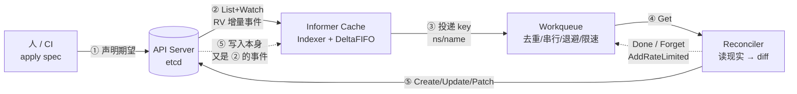

# Day 2 — controller-runtime 心智模型与控制循环闭环图

> 本文件是 Day 2 的产出：把 Kubebuilder Book（CronJob 教程）前三章读成一张自己能默画的闭环图，
> 并回答自检问题「reconcile 为何会被反复触发」「为何必须幂等」。
> 参照物是 kube-controller-manager 里 Deployment/ReplicaSet controller 的那套机制 ——
> 我们写的 Operator 只是把这套机制复用到自定义资源上，不是新发明。

---

## 一、一句话心智模型

**Kubernetes 是一台「水平触发（level-triggered）」的状态收敛机。**
用户只负责写 `spec`（期望状态），控制循环负责反复读现实、把它拉向期望；
现实与期望一旦不符就再跑一次，直到收敛。事件的作用只是「提醒去看一眼」，不是「命令去做某事」。

两个词必须分开：

| | level-triggered（K8s 用的是这个） | edge-triggered |
|---|---|---|
| 触发器 | 当前**状态**与期望不一致 | 某条**事件**发生了 |
| 丢事件 | 无所谓，下次看一眼还在 | 致命，状态永远回不来 |
| 对重复 | 天然无所谓（重看一遍结果相同） | 重复执行会做错事 |
| 对重启 | 无所谓（启动时全量 List 重建状态） | 重启丢事件 = 丢状态 |

所以：**控制器里永远不要「记住上次发生的事」，每次都从现实重新推导。**
这就是为什么 controller-runtime 的 Reconciler 签名只给一个
`reconcile.Request{NamespacedName}`，连对象本体都不给 —— 逼你自己去读最新现实。

---

## 二、五个角色

| 角色 | 是什么 | 关键性质 |
|---|---|---|
| **API Server (+etcd)** | 唯一真值来源 | 所有读写都走它；`resourceVersion` 单调递增；watch 提供增量事件流 |
| **Informer / Cache** | List+Watch 得到的**本地只读缓存** | Indexer（带索引的本地 map）+ DeltaFIFO + 事件分发给多个 handler；**弱一致**（可能落后） |
| **Workqueue** | 事件 → 任务的收敛泵 | 同 key 去重、同 key 不并发、指数退避 + 限速、优雅退出 |
| **Reconciler** | `Reconcile(ctx, req) (Result, error)` | 只看一个 key；**纯函数式**（无状态、随时可被重复调用/中断） |
| **Client** | 读写通道 | **读默认走 cache（快但可能旧）**，写直连 API Server（慢但强一致） |

一句话串起来：**API Server 提供真值 → Informer 把它缓存起来并变成事件 →
Workqueue 把事件收敛成 key → Reconciler 用 key 查缓存、算 diff、写回 API Server。**

---

## 三、闭环图（能徒手画出来的版本）

```
   ① 声明期望状态（spec）
   人 / CI / 上层 Operator
        │ kubectl apply / patch
        ▼
   ┌───────────────────────────────┐
   │      API Server  (etcd)       │◀──────────────┐
   │  Shortlink / Deployment / Svc │               │
   └───┬───────────────────────▲───┘               │
       │               ⑤ 写：Create/Update/Patch     │
       │                 （把现实推近期望）           │
       │ ② List + Watch（resourceVersion 增量事件）   │
       ▼                                           │
   ┌───────────────────────────────────────────┐   │
   │  Informer Cache（本地只读缓存，弱一致）      │   │
   │  Indexer + DeltaFIFO + processorListener   │   │
   └───────────────┬───────────────────────────┘   │
                   │ ③ 只投递 key： "ns/name"        │
                   ▼                               │
   ┌───────────────────────────────────────────┐   │
   │  Workqueue  去重 / 同 key 串行 / 退避 / 限速 │   │
   └───────────────┬───────────────────────────┘   │
                   │ ④ Get(key)                     │
                   ▼                               │
   ┌───────────────────────────────────────────┐   │
   │  Reconciler.Reconcile(ctx, req)            │   │
   │  读现实 → 算 diff → 只写不一样的部分          │   │
   └───────────────┬───────────────────────────┘   │
                   │ Done / Forget / AddRateLimited │
                   └───────────────────────────────┘
```

**关键在第 ⑤→② 那条回边**：Reconciler 自己写下去的东西（子资源、`status`）
会变成新的 watch 事件、再次进入 Workqueue。**控制循环是自己给自己供能的**，
这不是 bug，是设计：正因为有这条回边，控制器才不需要「知道」自己的写有没有生效 ——
它写下去，然后再被叫醒一次，看一眼，确认收敛了，就什么都不做（no-op）退出。

因此闭环成立的前提是三件事，缺一个都会炸：

1. **幂等**：回边会绕着圈回来，重复执行必须得到同一结果（否则每绕一圈多建一个 Deployment）。
2. **去重**：同一 key 的多个事件必须被折叠（否则一次震荡产生的事件能把自己淹死）。
3. **退避**：写失败会经回边变成新事件，没有退避就是热循环（每次失败都立刻重试，打爆 API Server）。

### Mermaid 版（GitHub 上可直接渲染）



---

## 四、自检问题 1：reconcile 为什么会被反复触发？

同 key 被重复入队有 **6 个来源**，一个都不能靠「控制事件数量」解决：

1. **周期性 resync**：informer 的 `ResyncPeriod` 到点会把缓存里所有对象重新投一遍
   （默认 `SharedInformerFactory` 里 10h 量级；controller-runtime 默认关闭，但机制在）。
2. **对象被多次修改**：`kubectl apply` 一次、kubectl edit、别的控制器改它 ——
   每次 Update 都是一个新事件。注意 `GenerationChangedPredicate` 只滤掉 **status-only** 更新，
   滤不掉 spec 多次修改。
3. **自己的 error / Requeue**：`Reconcile` 返回 `err != nil` 或 `Result{RequeueAfter: d}`
   都会把同一个 key 放回队列（走限速器，这是第 3+ 类来源）。
4. **启动时全量 List**：manager 一启动，informer List 出集群里所有对象，每个都是 `Add` 事件。
   所以「重启一次 Operator，所有 CR 全部被调和一遍」是正常行为，不是 bug。
5. **`EnqueueRequestForOwner` 反向查找**：子资源（Deployment/Pod）变了，
   watch 到它 → 通过 ownerReference 反查回 Shortlink 的 key 入队。
   我们自己建了子资源的 watch，这一类来源是我们主动引入的。
6. **Watch 断线重连**：网络抖动/API Server 滚动更新导致 watch 断开，
   重连后从 `resourceVersion` 续传，可能补发一批事件。

**所以幂等不是「最好有」，是「唯一解」**：控制器收到的邀请数量不由自己控制。

另外一条容易误解的：**Workqueue 的去重只对「还排在队列里 / 正在处理中」的 key 生效**。
去重 ≠ 不重复执行 —— 一个 key 完全可能被 Get 出来执行 3 次，
因为这 3 次的中间状态（现实）不一样。

---

## 五、自检问题 2：为什么必须幂等？

把它拆成三层，每层都能独立论证「不幂等就崩」：

1. **语义层**：事件是「提示」，不是「指令」。收到 key ≠ 「需要创建 Deployment」，
   而 = 「去看一眼现在对不对」。所以每次都要先 Get 现实、再算 diff，
   只有不一样才写。**「先读后写」是幂等的实现形式**。
2. **机制层**：`⑤ 写 → ② 事件` 的回边让控制循环自激励。若 reconcile 是
   「无条件 Create」，则一次执行产生一条事件 → 再执行 → 再 Create → AlreadyExists 报错 →
   退避重试 → 又被调和 …… 变成永远收敛不了的自激振荡。
3. **可靠性层**：Operator 会被重启、会被 kill 到一半、会同时被多个事件唤醒。
   把「做到哪一步」记在进程内存里（比如一个 `map[string]bool`）在重启后全部丢失，
   而 etcd 里的现实还在 —— 幂等的写法天然免疫这件事，因为**现实本身就是唯一的状态载体**。

**本项目里幂等的可验证证据**（Roadmap Day 8 的自检）：对同一个 CR 连续触发 10 次 reconcile，
断言 Deployment 的 `resourceVersion` 不变 —— 即「无变化时零写入」。

---

## 六、三个最容易踩的心智陷阱

| 陷阱 | 错误心智 | 正确心智 |
|---|---|---|
| 把事件当命令 | 「我收到了 Update 事件，所以要去改 Deployment」 | 「我收到了 Update 事件，所以要去**看一眼**；改不改由 diff 决定」 |
| 把 cache 当强一致 | 刚 `Create` 完立刻从 cache 读，读不到以为失败 | 写直连 API Server、读走 cache ⇒ **写后立即读可能读到旧值**；要强一致得用 `mgr.GetAPIReader()` 直读 |
| 把 Reconcile 当「完整流程」 | 「这个方法从头跑到尾才算成功」 | 「每次只推一小步，随时可以被中断并重新开始」；中途任何一步失败都能靠下一次调和补上 |

补一条与 Day 1 面试题的连接：**弱一致快照能不能用，判据是「它参不参与控制决策」**。
`Reconcile` 里的所有判断（该不该建、要不要扩、算不算 ready）都是控制决策，
所以真值只能来自 API Server / informer cache + lister（**它们至少是同一个 watch 流里的一致快照**），
用本地累加的计数器去做决策＝用过期快照做决策，结果是 flapping 或者误删健康 Pod。

---

## 七、与项目一（sre-from-zero）的对照

| 项目一（消费侧） | 本项目（生产侧） | 同一个机制的两个名字 |
|---|---|---|
| `kubectl get pods` 看现实 | informer cache 看现实 | 都是读 API Server 的缓存视图 |
| 手动 `kubectl delete pod` | 事件进 Workqueue 触发调和 | 都是「状态变了 → 有人去看一眼」 |
| 运维人肉判断+执行 | `Reconcile` 里的 diff 逻辑 | 都是「比较期望与现实 → 决定动作」 |
| 写进运维手册/CI 脚本 | 写成控制面代码 | 把经验固化成平台能力 |

一句话：**Deployment 的 controller 干的就是我们要干的事**（它也在调和 ReplicaSet、也在自愈），
差别只是它调和 `ReplicaSet`，我们调和 `Shortlink`。

---

## 八、走完 Day 2 我能做到的事

- [x] 徒手画出上面那张闭环图，并指出 ⑤→② 的回边
- [x] 说清 reconcile 反复触发的 6 类来源
- [x] 说清幂等的三层理由，并给出可验证证据的形式（连续调和 RV 不变）
- [x] 分清 level-triggered 与 edge-triggered 的行为差异（丢事件、重复、重启三种情况各会发生什么）
